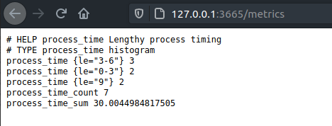

# Shiny Basics

In this wee vignette we give just basic examples of how to use titan in shiny applications.

## Helpers

Titan allows easily tracking some interactions by default, saving you the trouble of setting up metrics.

Starting from the (very) basic shiny application below which simply prints text to the console at the click of a button.

```r
library(shiny)

ui <- fluidPage(
  actionButton("click", "click me!")
)

server <- function(input, output){
  observeEvent(input$click, {
    cat("Logging one click\n")
  })
}

shinyApp(ui, server)
```

We will see how to define custom metrics later but before we do so, there are a number out-of-the-box (optional) metrics that titan provides:

1. Inputs: Tracks all input messages sent from the front-end to the server to better understand which are most used. This is handled with a counter that uses the `name` of the inputs as `labels`.
2. Visits: Tracks the total number of visits to the shiny application with a counter.
3. Concurrent: Tracks the number of concurrent users currently on the application with a gauge.
4. Duration: Tracks the session duration; the time (in seconds) users stay and interact with the application.

As mentioned, all of those are optional (off by default) but whether you use the defaults presented here and/or your custom metrics you __must use__ `titanApp` to launch the application. 

This function takes the same inputs as `shinyApp` and more. The arguments `inputs`, `visits`, `concurrent`, and `duration`, which all default to `NULL` meaning they are not being tracked. To track those metrics one must pass it a character string defining the name of the metric. 

```r hl_lines="1 15"
library(titan)
library(shiny)

ui <- fluidPage(
  actionButton("click", "click me!")
)

server <- function(input, output){
  observeEvent(input$click, {
    cat("Logging one click\n")
  })
}

# use titanApp
titanApp(
  ui, server,
  inputs = "inputs",
  visits = "visits",
  concurrent = "concurrent",
  duration = "duration"
)
```

!!! danger
    On a large application tracking all inputs can create a lot of data.

## Counter

Let's use titan to track the number of clicks on this button rather than use the defaults provided by titan. We can use a counter since the number of clicks can only increase over time.

Load the titan package then create the counter. Note that it is created outside the application, as it only needs to be created once, placing it in the `server` would recreate it every time. Though this should not be an issue as titan prevents you from overwriting an already created counter it is best to avoid it.

In the observer we increment the counter, then note that we launch the application with `titanApp` and not `shinyApp`, it works the exact same way but exposes the metrics.

```r
library(titan)
library(shiny)

# create the counter
c <- Counter$new(
  name = "btn_click_total",
  help = "Number of clicks of the button"
)

ui <- fluidPage(
  actionButton("click", "click me!")
)

server <- function(input, output){
  observeEvent(input$click, {
    c$inc()
    cat("Logging one click\n")
  })
}

# use titanApp
titanApp(ui, server)
```


## Histogram

We can also use a histogram to track the performances of a particularly long request.

Say for instance, that the application, at the click of a button, makes a relatively large request to a database or runs a time consuming model, surely we'd like to track that.

We can build a histogram to track the time it takes to run that process. We'll use the histogram to put the time it takes into three bins:

- Less than 3 seconds
- Between 3 and 6 seconds
- 6 Seconds and more

```r
library(titan)
library(shiny)

classify <- function(value){
  v <- as.numeric(value)
  
  if(v < 3)
    return(bucket("0-3", v))
  else if (v > 3 && v < 6)
    return(bucket("3-6", v))
  else
    return(bucket("9", v))
}

hist <- Histogram$new(
  "process_time",
  "Lengthy process timing",
  predicate = classify
)

ui <- fluidPage(
  actionButton("click", "click me!")
)

server <- function(input, output){
  observeEvent(input$click, {
    start <- Sys.time()

    on.exit({
      diff <- Sys.time() - start

      hist$observe(diff)
    })

    Sys.sleep(sample(1:9, 1))

    cat("Done with process\n")
  })
}

titanApp(ui, server)
```



## Gauge

You could also create a gauge to track the current number of visitors on the application using a Gauge.

It's as simple as initialising the Gauge and increasing it by one every time the server fires.

```r
library(shiny)

g <- Gauge$new(
  "visitors_total",
  "Current number of visitors"
)

ui <- fluidPage(
  h1("Hello")
)

server <- function(input, output){
  g$inc()
}

titanApp(ui, server)
```
